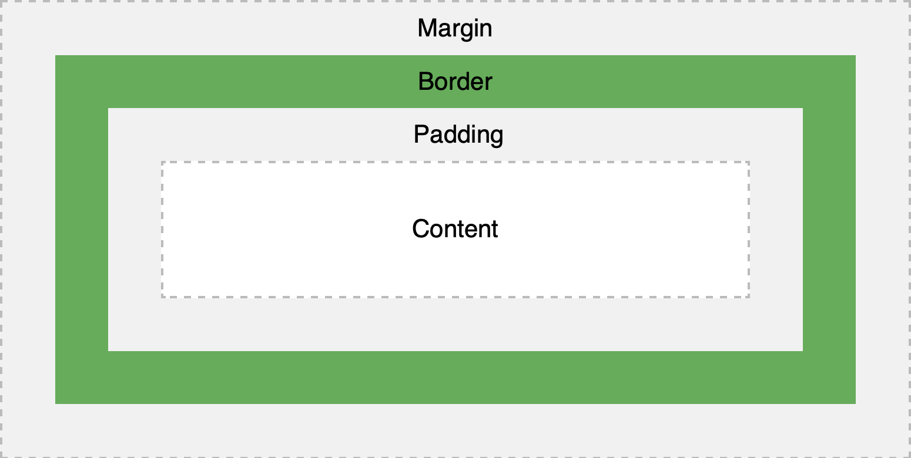

# HTML/CSS 교육

NHN 신입 교육으로 HTML/CSS 교육을 들었다. 학생 때 프론트엔드 부분을 거의 다루지 않았고, HTML의 태그가 다른 프로그래밍 언어와는 다른 형식으로 되어 있어서 꺼려했었는데 막상 입사하니까 백엔드와 프론트엔드까지 전부 다루게 될 줄은 몰랐다.. 나에게는 조금 생소한 언어지만, 이 기회를 통해서 태그 공포증(?)을 없앴으면 좋겠다.

이 교육은 총 4시간으로 이루어져 있었고, HTML을 먼저 배운 후 CSS를 배우는 것으로 진행되었다.

  

## HTML과 CSS, Javascript

**HTML**

* HTML은 웹의 구조와 내용을 서술하고 정의하는 문서이다. 


**CSS**

* CSS는 페이지의 구조나 내용의 디자인을 담당한다.
* 버튼 등 HTML에서 정의한 내용들의 색깔, 위치 등을 잡아주는 역할이다.


**Javascript**

* HTML 문서에서 기능과 액션을 정의한다.
* 데이터 로드나 팝업창 열기 등


## HTML 문서 구조

HTML 문서의 구조를 살짝 정리해 보았다.

```html
<!DOCTYPE html>  <!--문서를 html형식으로 해석할 것 -->
<html lang="ko">				<!-- html 문서를 감싼다. lang 속성은 검색과 음성장치에서 활용 -->
<head>
	<meta charset="UTF-8">  <!-- meta 태그: 문서에 대한 정보 요약 -->
    <title> 토스트 루키 </title> <!-- 문서의 제목을 표시하는 태그 -->
</head>
    
<body>
	<h1>제목 1</h1>			<!-- h1~h6태그: 제목태그 -->
    <p>							<!-- 단락 태그 -->
        단락
    </p>
    
    <ol>					<!-- ol, li태그: 계층구조(리스트)를 표현 -->
        <li>리스트1</li>
        <li>리스트2</li>
    </ol>
    <strong>strong</strong>	<!-- 강조 표현 -->
    <em>em</em>				<!-- 기울임 -->
    
    <blockquote>			<!-- 인용구 표현 -->
        아아아아아아
    </blockquote>
    
    <pre> Toast </pre>		<!-- 미리 지정된 서식 그대로 표현 -->
    <code> code </code>		<!-- monospace 글꼴로 표현 -->
    
    <a href="http://www.payco.com" target="blank">Payco</a>	<!-- 하이퍼링크 -->
    					<!-- 이미지 -->
    
    <div>					<!-- Division 약자로 영역을 나눌 때 사용 -->
        					<!-- Display 속성이 block>
        DIV
    </div>
</body>
    
</html>
```

**\<DOCTYPE {doc}>**

* 문서의 해석 방법을 정의한다. 
* html이 들어가면 html 형식으로 해석하게 된다. 
* DOCTYPE을 생략하면 html이 아니라 Quicks mode로 렌더링하는데, 문제가 발생하게 된다.


**\<html>**

* html 전체를 감싸는 태그이다.
* lang : 웹 접근성을 준수하기 위해 정의할 수 있는 어트리뷰트로, 검색과 음성장치에서 사용된다.


**\<head>**

* html 문서에 대한 정보를 나타내는 태그.
* \<meta>: 문서에 대한 정보를 요약한다. 인코딩, 저자, 대표 이미지 등을 정의할 수 있다.
* \<title>: 문서의 제목을 표시하는 태그이다. 브라우저 창에 표시되는 제목으로 생각하면 된다.


**\<body>**

* 문서에서 사용자에게 보이는 부분이다.


### body 부분 내에 들어가는 태그

| 태그       | 내용                                                         |
| ---------- | ------------------------------------------------------------ |
| h1~h6      | 제목, 부제목 등의 태그이다. 숫자가 커질 수록 글자 크기가 작아진다. |
| p          | paragraph의 약자로, 일반적인 텍스트의 단락을 표현한다.       |
| ol, li     | 계층구조(리스트)를 표현, ol은 순서 있는 리스트 (ordered list) |
| ul, li     | 계층구조(리스트)를 표현, ul은 순서 없는 리스트 (unordered list) |
| strong     | 굵은 글씨 (bold)                                             |
| em         | 기울임                                                       |
| blockquote | 인용구                                                       |
| pre        | 미리 지정된 서식 그대로 표현                                 |
| code       | monospace 글꼴로 표현                                        |
| a          | 하이퍼링크를 표현<br>* href: 이동할 주소<br>* target: 페이지 이동 방식 |
| img        | 이미지를 넣어준다.<br>* src: 이미지 경로<br>* alt: 이미지가 보이지 않을 때 나타낼 텍스트 |


## Semantic Element

Sementic Element란 의미론적인 element로, 시각적으로 보여지기 위한 태그가 아니라, '이 영역은 어떤 영역이다' 라는 것을 명시하기 위한 태그이다. \<div>와 거의 동일한 역할을 한다.

Sementic Element는 다음과 같은 종류가 있다.

| 태그       | 의미                                                         |
| ---------- | ------------------------------------------------------------ |
| \<main>    | 문서의 주요 콘텐츠를 포함하며, 문서 내에 단 하나만 존재한다. |
| \<header>  | 문서 소개나 탐색을 돕는 것의 그룹을 짓는 태그이다.           |
| \<section> | 문서의 일반적인 구획을 나타내는 태그임며, 여러 중심 내용을 감싸는 공간이다. |
| \<footer>  | 문서의 footer 부분이며, 작성자 구획, 저작권 데이터, 관련 문서의 링크에 대한 정보를 담고있다. |
| \<nav>     | 현재 페이지 내, 또는 다른 페이지로의 링크들이 있다는 것을 나타내는 태그 |
| \<aside>   | 주요 내용과 간접적으로만 연관된 부분을 나타내는 태그         |
| \<figure>  | 문서의 멀티미디어 요소를 나타내는 태그                       |
| \<article> | 글자가 많이 들어가는 부분을 나타내는 태그                    |


Sementic Element는 기능적으로는 역할을 하지 않지만, 이 태그를 사용하면 문서의 내용들을 각각의 부분들로 나누어져 개발자들이 보기 편하다고 하였다. 설계 관점에서 큰 도움이 되지 않을까 싶다.


## CSS 기본 구조와 셀렉터

이번 부터는 CSS에 대하여 배운 것을 정리하겠다. CSS는 Cascading Style Sheet의 줄임말로, 문서의 표현을 기술하는 스타일 시트 언어라는 뜻이다. 즉, HTML의 내용(버튼이나 글, 리스트 등)의 레이아웃이나 폰트, 폰트 색, 배경색 등 디자인을 담당하는 언어라고 생각하면 된다.

CSS의 구성요소는 다음과 같다.

```css
div, p(셀렉터){
	color: sky-blue;
	(속성)	  (값)
}
```


### CSS의 적용 방법

CSS의 적용 방법은 총 3가지가 있다.

  

**Inline**

* 각 태그마다 스타일을 모두 적는 방법으로 **관리가 쉽지 않다.**
* 우선순위가 가장 높기 때문에, **상속 면에서 좋지 않다.**
* 단점이 많아서 거의 쓰이지 않는다.

```html
<div style="display:none;"></div>
```

  

**Embedded**

* head 안에 style로 감싸서 정의한다.
* CSS가 간단한 페이지인 경우 사용한다.

```html
<head>
  <style>
    div {display: none;}
  </style>
</head>
```

  

**External**

* 별도의 CSS 파일로 분리하여 관리한다.
* 가장 일반적인 방법으로, 교육 내용은 거의 External로 배운다.

```html
<link rel="stylesheet" href="../src/css/index.css">
```

  

### CSS의 상속

부모 엘리먼트에 적용된 스타일이 자식 엘리먼트에도 적용되는 것을 상속이라고 한다.

```html
<div style="color: yello;">
	<div></div>	<!-- color: yello -->
<div>
```

하지만 모두가 상속이 되지는 않는다. 특정 속성은 상속이 되지 않는데 다음 표를 참고하면 될 것 같다.


|       property        | Inherit |
| :-------------------: | :-----: |
|     width/height      |   no    |
|        margin         |   no    |
|        padding        |   no    |
|        border         |   no    |
|      box-sizing       |   no    |
|        display        |   no    |
|      visibility       |   yes   |
|        opacity        |   yes   |
|      background       |   no    |
|         font          |   yes   |
|         color         |   yes   |
|      line-height      |   yes   |
|      text-align       |   yes   |
|    vertical-align     |   no    |
|    text-decoration    |   no    |
|      white-space      |   yes   |
|       position        |   no    |
| top/right/bottom/left |   no    |
|        z-index        |   no    |
|       overflow        |   no    |
|         float         |   no    |

  

### CSS 셀렉터

CSS 셀렉터는 CSS를 적용할 요소를 지칭하는 것을 나타낸다.

  

**태그 셀렉터**

```html
<p> 안녕하세요 </p>									<!-- red -->
<p id="hello"> 안녕하세요. </p>			<!-- red -->
<p class="hello"> 안녕하세요. </p>		<!-- red -->

p {
	color: red;
}
```

* 태그 셀렉터는 해당 태그로 된 모든 엘리먼트에게 CSS를 적용한다.
* 즉, 위의 3가지의 p태그를 가진 요소들은 선언된 CSS가 적용된다.

  

**ID 셀렉터**

```html
<p> 안녕하세요 </p>									<!-- 적용x -->
<p id="hello"> 안녕하세요. </p>			<!-- red -->
<p class="hello"> 안녕하세요. </p>		<!-- 적용x -->

#hello {
	color: red;
}
```

* id값 앞에 #을 붙여서 선택한다.
* 태그 옆에 있는 id 속성은 유일한 값이어야 한다.
* 하지만 우선순위가 가장 높아서 쓰지 않는 것이 좋다.

  

**클래스 셀렉터**

```html
<p> 안녕하세요 </p>									<!-- 적용x -->
<p id="hello"> 안녕하세요. </p>			<!-- 적용x -->
<p class="hello"> 안녕하세요. </p>		<!-- red -->

.hello {
	color: red;
}
```

* class 값 앞에 .을 붙여서 선택
* 태그 옆에 있는 class 속성은 같은 것이 여러개여도 관련 없음. 이름을 붙여주는 것
* 가장 많이 쓰이는 셀렉터

  

**속성 셀렉터**

```html
<p id="hello">안녕하세요.</p>						<!-- 적용 x -->
<p class="hello">안녕하세요.</p>					<!-- 적용 x -->
<input type="button" value="안녕하세요">	<!-- green -->

[type="button"] {
	color: green;
}
```

* 대괄호 안에 속성명="값" 형태로 사용한다.


**자손 셀렉터**

```html
<header>
  <h1>Toast Rookie</h1>
  <h2>Welcome to nhnent.</h2>
</header>

header h1,
header h2 {
	color: red;
}
```

* header와 h1, h2는 부모-자식 관계이다. html에서 부모자식 관계는 이런 형식으로 이루어진다.
* h1과 h2는 형제 관계이다. 

* 자손 셀렉터를 선택할 시에는 부모 셀렉터 [공백] 자손 셀렉터로 표시한다.
* 여러 셀렉터를 적용할 때는 ,로 구분한다.


**자식 셀렉터**

```html
<header>
	<p>Toast Rookie</p>					<!-- header의 자식 -->
  <div>
    <p>Welcome to nhnent.</p>	<!-- header의 자손(O), header의 자식(X) -->
  </div>
</header>

header > p {
	color: red;
}
```

* 부모와 자식 선택 시 꺽쇠를 사용한다.


**자손과 자식의 차이**

* 자손은 자신의 자식, 손자, 증손자 등등....을 모두 나타낸다.
* 하지만 자식은 자신의 바로 아랫 단계인 자식만을 나타내며, 손자부터는 자식이라고 하지 않는다.


**바로 뒤 형제 셀렉터**

```html
<h1>h1</h1>
<p>nhn</p>		<!-- red -->
<h2>h2</h2>
<p>nhn</p>		<!-- 적용 X -->
h1 + p {
  color: red;
}
```

* 바로 뒤 형제 선택 시 +를 사용한다.
* 바로 뒤 형제 외에는 적용되지 않는다.


**뒤에 오는 형제 셀렉터**

```html
<h1>h1</h1>
<p>nhn</p>		<!-- red -->
<h2>h2</h2>
<p>nhn</p>		<!-- red -->
h1 ~ p {
  color: red;
}
```

* 뒤에 오는 모든 형제 선택 시 ~을 사용한다.


**전체 셀렉터**

```html
<header>
  <p>Toast Rookie</p>
  <div>
  	<p>Welcome to nhnent.</p>
  </div>
</header>

header * {
	color: red;
}
```

* 모든 엘리먼트 선택 시 *을 사용한다.
* 성능에 좋지 않아서 남발하지 않는 것이 좋다.


### CSS 유사 클래스 셀렉터

유사 클래스 셀렉터란 엘리먼트의 특별한 상태일 때를 선택하는 셀렉터이다. 마우스가 올라가 있거나, 선택되어 있거나 등 어떠한 이벤트가 발생했을 때의 디자인을 이 셀렉터를 이용하여 달리할 수 있다.

유사 클래스 셀렉터는 다음과 같이 사용할 수 있다.

```html
<header>
	<p>Toast Rookie</p>
  <div>
    <p>Welcome to nhnent</p>
  </div>
</header>

header > p:hover {
	color: red;
}
```

* 셀렉터:{유사 클래스 셀렉터}로 정의할 수 있다.
* 이 셀렉터는 마우스가 올라가있을 때 발생하는 셀렉터이다.


유사 클래스 셀렉터는 다음과 같이 여러 종류가 있다.

| 유사 클래스 셀렉터        | 설명                      |
| ------------------------- | ------------------------- |
| :hover                    | 마우스 오버               |
| :active                   | 클릭된 상태               |
| :focus                    | 포커스가 있을 때          |
| :checked                  | 체크 상태일 때            |
| :disabled                 | 사용 불가능일 때          |
| :first-child, :last-child | 해당 요소 첫 번째, 마지막 |


## CSS 박스 모델과 Flexible 박스

### CSS 박스 모델

CSS 박스 모델이란, 브라우저가 엘림먼트를 렌더링 할 때 참고하는 값으로, CSS 레이아웃에 기본이 되는 개념이다.

구성요소는 다음과 같다.

{:class="img-fluid"}


* Margin: 바깥 여백
* Border: 테두리
* Padding: 안쪽 여백
* Content: 내용


### background-clip

배경을 어떻게 채울지 (어느 영역까지) 정하는 속성

* border-box: 테두리 영역 까지
* padding-box: 안쪽 여백부터 테두리 전 까지
* content-box: 안쪽 여백을 제외한 내용 부분만.
* text: 텍스트 위로만


### box-sizing

엘리먼트의 박스 크기를 지정한다.

* content-box: 내용을 기준으로 엘리먼트 크기를 잡음
* border-box: 테두리를 기준으로 엘리먼트 크기를 잡음


### width, height

엘리먼트의 크기를 지정한다. 크기를 지정하는 방법은 여러가지가 있다.

1. px 크기로 잡는다.

```css
.box {
  width: 200px;
  height: 300px;
}
```

2. auto로 잡는다. auto로 잡으면 content의 크기에 맞춰서 크기가 결정된다.

```css
.box {
  width: auto;
  height: 300px;
}
```

3. %로 전체 크기의 비율을 정할 수 있다.

```css
.box {
  width: 75%;
  height: 300px;
}
```

4. min-과 max-로 최소, 최대 크기를 정할 수 있다.

```
.box {
	width: 75%;
	height: 300px;
	min-width: 100px;
	max-width: 300px;
}
```


### Margin과 Padding

margin은 바깥 여백, padding은 안쪽 여백을 의미한다.

각각의 크기를 정하는 방법은 다음과 같다.

1. 하나의 값: 네 면 모두를 설정

```css
.target {
    width: 500px;
    height: 200px;
    background: #00a2ff;
    margin: 10px;
}
```

2. 두 개 값: 상하와 좌우 값을 설정

```css
.target {
    width: 500px;
    height: 200px;
    background: #00a2ff;
    margin: 10px 3px;
}
```

3. 세 개 값: 상, 좌우, 하 값을 설정

```css
.target {
    width: 500px;
    height: 200px;
    background: #00a2ff;
    margin: 10px 5px 20px;
}
```

4. 네 개 값: 상, 우, 하, 좌 값을 설정 [시계방향]

```css
.target {
    width: 500px;
    height: 200px;
    background: #00a2ff;
    margin: 10px 5px 20px 15px;
}
```

5. margin-{방향} (padding-{방향}) 으로 명시하는 방법

```css
.target {
    width: 500px;
    height: 200px;
    background: #00a2ff;
    margin-top:
    margin-left:
    margin-right:
    margin-bottom
}
```


### Border

border는 엘리먼트의 테두리를 의미한다. 처음에 엘리먼트를 생성할 때는 보이지 않는데, border-style의 값을 채우면 테두리를 볼 수 있다.

```css
.box {
	width: 200px;
	height: 200px;
	background: #CCCCC00;
	border: solid red 5px dashed #000;	// 순서가 바뀌어도 무방
}
```

* border-style
  * solid: 실선
  * dashed: - - - - - -
* border-color: 선의 색깔
* border-width: 선의 굵기


### Display

엘리먼트를 블록과 인라인 중 어느쪽으로 처리할지 결정할 수 있다. block은 세로로 나열, inline은 가로로 나열이라고 생각하면 된다.


#### Block

대표적으로 \<p> 태그가 block이다.

* width, height, margin, padding 속성이 동작한다.
* **margin: x auto;**를 통해 가로 가운데 정렬이 가능하다.


#### Inline

대표적으로 \<span> 태그가 inline이다

* 여러 요소가 한 행에 있을 수 있다.
* width, height, margin의 top, bottom이 동작하지 않는다.
* content의 길이 만큼 width를 가진다.
* 가운데 정렬을 하려면 부모 엘리먼트의 text-aline: center로 가능하다.


#### display: inline-block

여러 요소와 같이 한 행에 있을 수 있다. (\<p>도 강제로 inline 속성을 가지게 된다.)

```html
<div class="parent">
	<p>Hi</p><p>Hi</p><p>Hi</p>
	<span>Rookie</span><span>Rookie</span>
<div>
```

```css
p, span {
	display: inline-block;
  margin: 10px;
  padding: 10px;
  width: 100px;
  height: 30px;
}
```

* width, height, margin, padding을 모두 가질 수 있다.
* 가운데 정렬을 하려면 부모 엘리먼트의 text-aline: center로 가능하다.


#### display: none

해당 요소를 화면에서 보이지 않게 함 (완전 삭제는 아님)

visibility: hidden과 비슷한 역할을 하지만 엘리먼트의 영역을 유지해주냐의 차이점이 있다.

visibility: hidden은 엘리먼트의 영역을 유지해주지만, display: none은 유지하지 않는다.