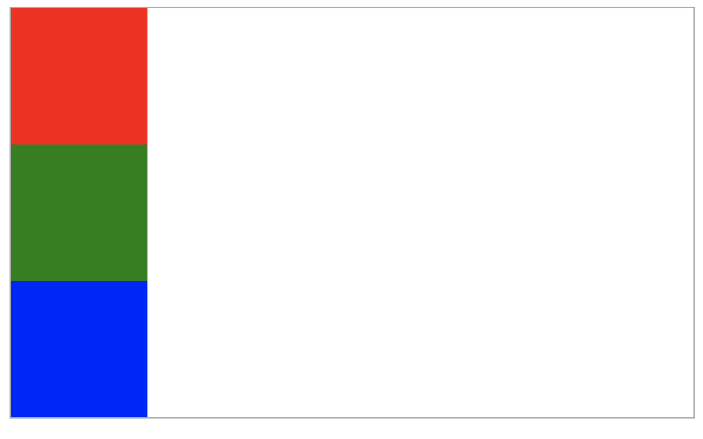
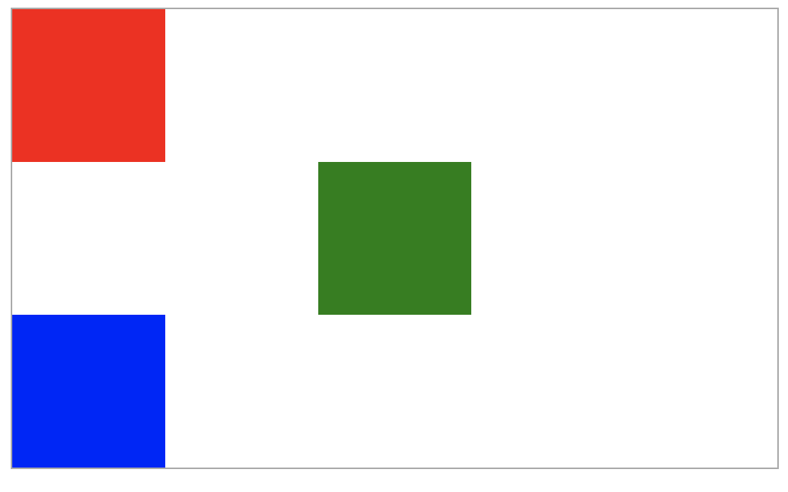
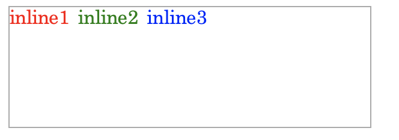
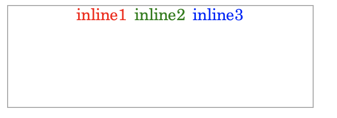
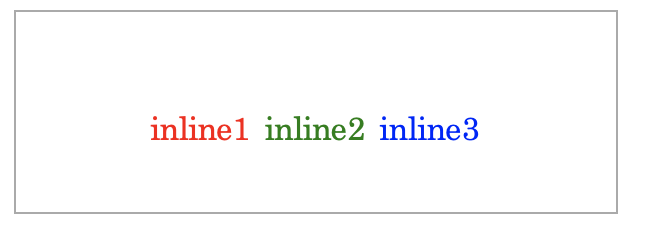

# HTML/CSS 교육 (2)

수업을 듣고 이해가 잘 되지 않아 집에서 계속 곱씹으면서 정리하고 있다. 프론트엔드 쪽으로 공부를 잘 안해봐서 그런지 쉽게 와닿지 않는다. 특히 레이아웃 배치와 관련해서 이해를 거의 하지 못했기 때문에 연습이 더 필요한 것 같다.

이번에는 컨테이너 정렬부터 이미지 스프라이트까지의 내용을 다룰 것이다.

  

## 가로 정렬과 세로 정렬

컨테이너를 나열하는 방법은 총 두 가지가 있다. 세로로 나열하는 **Block**과, 가로로 나열하는 **Inline**이 있다. 각각의 가로 정렬과 세로 정렬의 방법은 서로 다른데, 그 방법들을 알아보자.


#### Block의 가로 정렬

일단, 처음 block 적용을 다음과 같이 하자.

```html
<div class="container">
  <div class="child"></div>
  <div class="child"></div>
  <div class="child"></div>
</div>
```

```css
.container {
    width: 500px;
    height: 300px;
    display: "block";
    border: 1px solid #aaa;
}

.child:nth-child(1) {
    background-color: red;
    width: 100px;
    height: 100px;
}
.child:nth-child(2) {
    background-color: green;
    width: 100px;
    height: 100px;
}
.child:nth-child(3) {
    background-color: blue;
    width: 100px;
    height: 100px;
}
```



가로 정렬은 다음과 같이 한다.

```css
.child:nth-child(2) {
  	...
    margin: 0 auto; /* 가로 정렬 */
}
```



#### Inline의 가로 정렬

inline 적용을 다음과 같이 하자.

```html
<div class="container">
  <span class="inline">inline1</span>
  <span class="inline">inline2</span>
  <span class="inline">inline3</span>
</div>
```

```css
.container {
    width: 300px;
  	height: 200px;
    display: "inline";
    border: 1px solid #aaa;
}

.inline:nth-child(1) {
    color: red;
}
.inline:nth-child(2) {
    color: green;
}
.inline:nth-child(3) {
    color: blue;
}
```




가로 정렬은 다음과 같이 할 수 있다. (가운데 정렬 예시)

```css
.container {
  text-align: center; /* {left; right} */
}
```



세로 정렬은 line-height 속성으로 조절할 수 있다.

```css
.inline:nth-child(1) {
    color: red;
    line-height: 20px;
}
.inline:nth-child(2) {
    color: green;
    line-height: 120px;
}
.inline:nth-child(3) {
    color: blue;
    line-height: 70px;
}
```



하지만, 결과를 보면 세로 정렬은 block의 가로 정렬과 달리, 높이를 다르게 설정할 수 없다. 각각의 line-height가 다를 경우, 위치는 가장 큰 값으로 결정된다.


### Flex 가로/세로 정렬

Flex의 가로 세로 정렬은 두 가지 방법이 있다.

**justify-content**: flex-direction과 같은 방향을 정렬할 때 사용

**align-items**: flex-direction과 수직 방향을 정렬할 때 사용


처음 컨테이너 설정을 다음과 같이 하자.